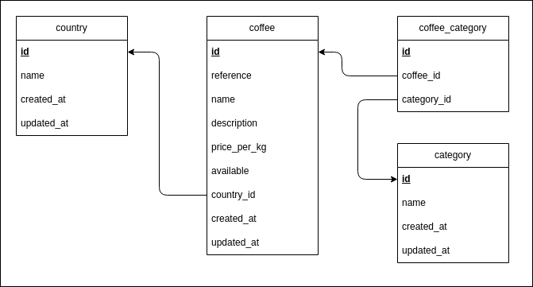

# MLD

Convention de nommage pour les tables et les champs :
- anglais
- snake_case

On ajoute les **id** et les **timestamps**.

## Version texte

```
country (
  #id               -- integer PRIMARY KEY
  name              -- text  
  created_at        -- timestamp
  updated_at        -- timestamp
)


category  (
  #id               -- integer PRIMARY KEY
  name              -- text
  created_at        -- timestamp
  updated_at        -- timestamp
)


coffee  (
  #id               -- integer PRIMARY KEY
  reference         -- text
  name              -- text
  description       -- text
  price_per_kg      -- decimal
  available         -- boolean
  country_id        -- integer FOREIGN KEY country(id)
  created_at        -- timestamp
  updated_at        -- timestamp
)


coffee_category (
    #id             -- integer PRIMARY KEY
    coffee_id       -- integer FOREIGN KEY coffee(id)
    category_id     -- integer FOREIGN KEY category(id)
)
```

## Version schématique

